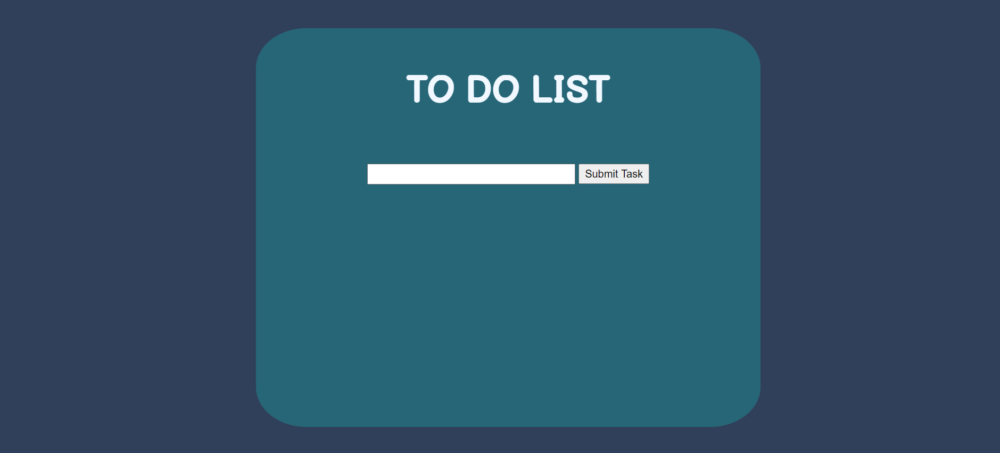

# todo-app

Simple To-Do application made with JavaScript HTML and CSS

Give it a try [here](https://kaelix.github.io/todo-app/)

How to:
  Enter a To-do task in the input field
  Click "submit task" button to start your to-do list
  Click on desired text to mark the task completed
  Delete button on the right of the desired task removes item from list
  
  
  
  # Summary
  
  A project I made to learn JavaScript to build not only technical skills but also build my knowledge on software development to help push me towards my 
  goal of becoming a professional full stack software developer. Although challenging, the challenges faced in this project moved me closer to my goal 
  and gave me new skills to put towards future projects. 
  
  # Author
  Cesar Preza - Aspiring software developer
